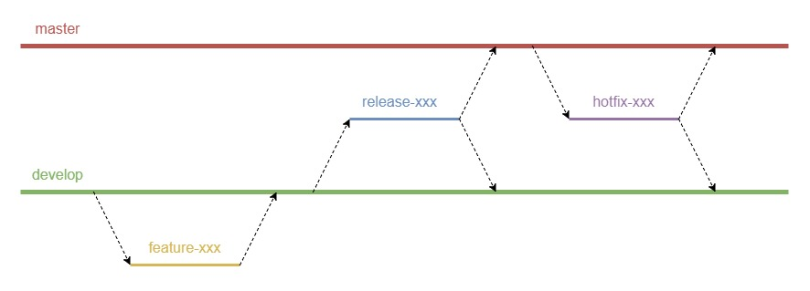

# Git Branching Model

Tài liệu này mô tả:

- Mô hình branch trong GIT
- Mục đích sử dụng của các loại branch

## 1. Khái quát chung



GIT repository bao gồm nhiều branch, mỗi branch bao gồm nhiều commit.

- Một branch được coi như một "phiên bản" của codebase, nhằm phục vụ cho một mục đích nào đó. Một branch được xác định bởi tên branch hay `branch name`. Ví dụ:

```sh
$ git branch

* master
  develop
  TATERU_WEB-1-coding-login-page

```

- Mỗi commit được coi như một "mô tả thay đổi" của codebase. Một commit được xác định bởi một mã hash. Ví dụ:

```sh
$ git log --oneline -10

6c9fde7 [2019-08-20] add base structures [Tuan Le]
1a3a5cf [2019-08-20] [init] add base mkdocs files [Tuan Le]
4b76a44 [2019-08-20] [empty] Initial commit [Tuan Le]

```

## 2. Branch chính (Main Branches)

- Là những branch tồn tại trong suốt quá trình phát triển (lifetime).
- Protected, KHÔNG ĐƯỢC thực hiện các hành động sau:
	- Xóa branch
	- Rebase, cherry-pick, hoặc bất cứ hành động thay đổi cấu trúc tree commit

Các branch chính bao gồm:

### 2.1. master

- Là branch chứa code **hoàn thiện** nhất (sau khi code, review, test).
- Thường được deploy trên môi trường production.

### 2.2. develop

- Là branch chứa code **mới** nhất (sau khi code, review, đang đợi test và fixbug).
- Thường được deploy trên môi trường testing.

## 3. Branch phụ (Supporting branches)

- Là những branch chỉ tồn tại trong một giai đoạn nào đó của quá trình phát triển (limited)
- Vòng đời của một branch phụ:
	- Tách nhánh (checkout) từ một trong các branch chính
	- Chỉnh sửa code
	- Hợp nhất (merge) với một hoặc cả hai branch chính
	- Xóa branch

Các branch phụ có thể bao gồm:

### 3.1. feature

- Dùng để phát triển tính năng mới hoặc fixbug trong quá trình phát triển.
- PHẢI checkout từ `develop`, merge vào `develop`
- Tùy theo phân loại task, CÓ THỂ đặt tên với tiền tố `feature-`, `enhancement-`, `bug-` hoặc đơn giản là chỉ dùng thống nhất tiền tố `feature-`
- Các task không có task, NÊN được đặt với tiền tố `support-` hoặc `na-`
- Quy ước đặt tên:

```sh
feature-{task-id}-mô-tả-ngắn-gọn
```

Ví dụ với task phát triển cho issue 20001, sẽ được đặt tên là:

```sh
feature-20001-coding-login-page
```

### 3.2. release

- Dùng để chuyển giao code từ branch `develop` sang branch `master`
- PHẢI checkout từ `develop`, merge vào cả `master` và `develop`
- Trong trường hợp code release có bug, có thể tạm tách branch `release-fix-` từ branch `release-`, fixbug và merge vào branch `release-`. Trong trường hợp này PHẢI merge lại branch `release-` vào branch `develop-`.
- Trong trường hợp code release không có bug, thông thường sẽ không cần phải merge lại branch `release-` vào branch `develop-`.
- Quy ước đặt tên:

```sh
release-X.X
```

Với X.X là phiên bản (version) của application tại thời điểm release, ví dụ với phiên bản là 0.1, sẽ được đặt tên là:

```sh
release-0.1
```

### 3.3. hotfix

- Dùng để fixbug phát sinh trên branch `master` sau khi đã thực hiện release.
- PHẢI checkout từ `master`, merge vào cả `master` và `develop`
- Quy ước đặt tên:

```sh
hotfix-X.X.Y
```

Với X.X là phiên bản (version) vừa release, Y là thứ tự bản hotfix, ví dụ với phiên bản là 0.1, bản fix thứ nhất, sẽ được đặt tên là:

```sh
hotfix-0.1.1
```